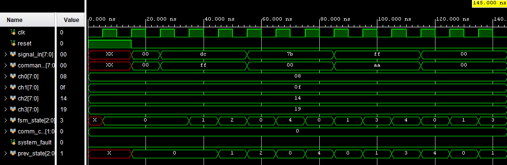

# 🛡️ EW-SIM-01: Electronic Warfare Threat Detection & Jamming Countermeasure System

**EW-SIM-01** is a defence-grade simulation project built using **SystemVerilog and Vivado**, designed to detect, classify, and respond to electronic threats such as **burst jamming**, **signal spoofing**, and **entropy-based attacks**. It simulates the core digital logic of an advanced Electronic Warfare (EW) unit used in military communication and sensor platforms.

---

## 📁 Project Structure

EW-SIM-01/
├── src/
│ ├── ew_sim_top.sv ← 🔝 Top-level integration module
│ ├── threat_detector.sv ← Detects burst jamming, spoofing, entropy
│ ├── command_authenticator.sv ← Authenticates incoming signal commands
│ ├── aes_lite_encryption.sv ← AES-lite secure encryption block
│ ├── dynamic_freq_selector.sv ← Frequency agility logic under attack
│ ├── known_threat_buffer.sv ← Memory for known/repeated threats
│ └── watchdog_unit.sv ← Monitors system failure and resets
│
├── testbench/
│ └── tb_ew_sim_01.sv ← ✅ Testbench simulating multiple threats

## 🧠 Key Features

- ✅ **7-State FSM**: IDLE, JAMMED, SPOOF_DETECTED, AUTHENTICATING, RECOVERY, LOGGING, THREAT_KNOWN
- ✅ **Threat classification**: Detects burst jamming, signal spoofing, entropy/random attacks
- ✅ **Command authentication**: Ensures command origin and integrity
- ✅ **AES-lite encryption**: Secure block to simulate message encryption/decryption
- ✅ **Frequency agility**: Changes communication frequency during jamming
- ✅ **Threat memory**: Recognizes known threats and bypasses re-processing
- ✅ **Watchdog unit**: Auto-reset in case of stuck system
- ✅ **Real-time TCL console logging** of FSM transitions and actions

---

## 🛠️ Tools Used

- Language: **SystemVerilog**
- Simulator: **Vivado Simulator**
- Design Methodology: FSM-based secure threat handling logic
- Testing: Custom Testbench, waveform logging, console tracing

---

## ▶️ How to Simulate

1. Clone this repo or download as ZIP  
2. Open Vivado → Create new project → Add all `.sv` files from `/src/`  
3. Add testbench `tb_ew_sim_01.sv` from `/testbench/`  
4. Set `tb_ew_sim_01` as top module  
5. Run **Behavioral Simulation**
6. View **TCL Console** and optional `EW_LOG.txt` for threat detection info  
7. Check FSM state transitions in waveform

---

## 📸 Waveform Preview

---

## 👨‍💻 Author

- **Ananay Rampal**
- Passionate about secure embedded/VLSI systems, defence applications & digital design

---

## 📜 License

This repository is intended for academic and educational use. Do not deploy in real-world defence without proper hardware and compliance.

---

🫡 _"One mistake, and we lose our lives. We built this system like our survival depends on it."_  
